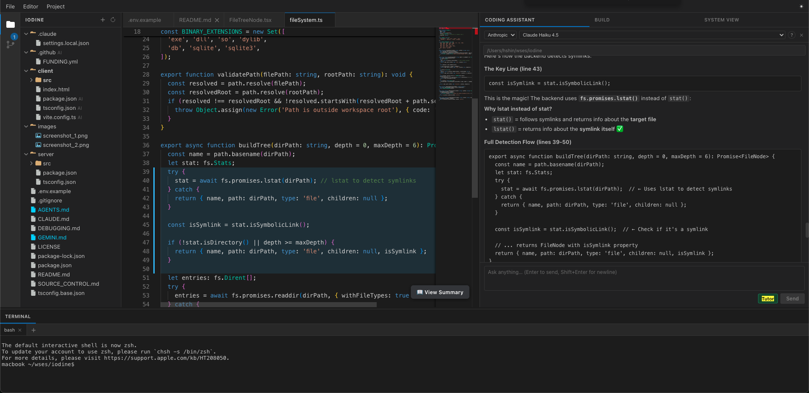
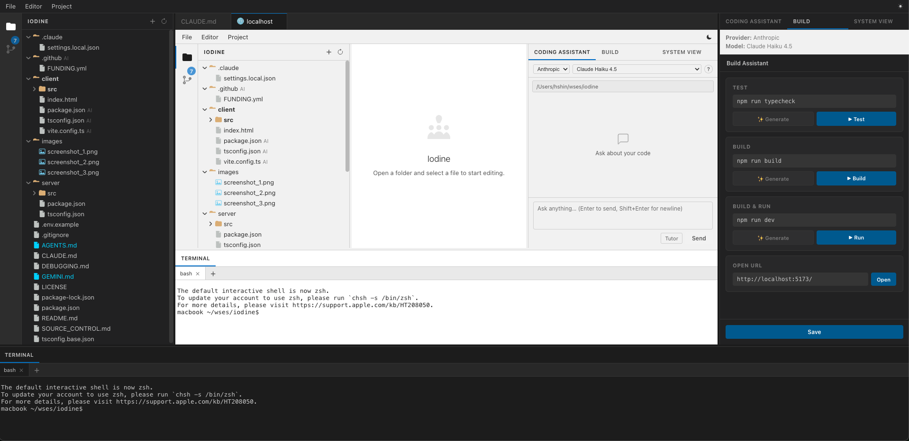

<p align="center">
  
</p>

<h1 align="center">Iodine — The IDE That Teaches You</h1>

<p align="center">
  An AI-native IDE that turns unfamiliar Git repositories into interactive learning environments.
</p>

## Tutor Mode

**Open any repository.**  
**Turn on Tutor.**  
**The IDE teaches you the project one file at a time.**

Tutor Mode is Iodine's central experience. The AI reads the codebase and presents a numbered walkthrough plan. Each subsequent reply opens exactly one file, highlights the relevant lines, and explains what to look at before waiting for you to continue. You can build understanding without losing control.

Every explanation is grounded in the real project—from architecture diagrams down to highlighted source lines.


<p align="center">
  More demos on YouTube: <a href="https://www.youtube.com/watch?v=5BlcEDO4Mrg">Demo 1</a> · <a href="https://www.youtube.com/watch?v=SjOQjkT9GJM">Demo 2</a> · <a href="https://youtu.be/M6C0rk1DwNs">Demo 3</a>
</p>

## The problem

Every engineer eventually opens a repository they do not understand.

Maybe it is your first week on a new team. Maybe it is a large open-source project. Maybe it is code you wrote two years ago. You know the feeling: hundreds of files, unfamiliar architecture, incomplete documentation, and no obvious place to begin.

Software engineers can spend weeks onboarding to unfamiliar systems. Documentation drifts, architecture diagrams become outdated, and AI assistants often solve problems without helping developers understand them.

Existing AI coding tools are excellent at generating code. Iodine explores a different approach: **using AI to shorten the path from unfamiliarity to confident contribution**.

Success is measured by whether the user becomes more capable after using Iodine.

Our long-term goal is to turn any Git repository into an interactive learning environment where AI explains architecture, guides exploration, connects documentation to implementation, and helps you make your first meaningful contribution without taking ownership away from you.

## Why Iodine is different

Iodine is organized around the learning journey:

### Understand

- **AI Summary** — Tutorial-style explanations of any file, including its role, APIs, data flow, and gotchas.
- **System View** — Interactive architecture diagrams generated from the actual source code, with nodes linked back to implementation.
- **Architecture highlighting** — Open a file and the corresponding System View node is highlighted automatically.

### Explore

- **Tutor Mode** — A read-only AI guide that walks through an unfamiliar codebase one file at a time, opening files and highlighting the lines worth studying.
- **Visible editor context** — The assistant automatically sees the code currently visible in your editor, so you can ask about what is on screen without copy-pasting.
- **Interactive navigation** — Move between explanations, source files, architecture, and documentation without leaving the IDE.

### Contribute

- **Coding Assistant** — Read, write, search, and modify workspace files with Claude, GPT, or Gemini.
- **Build Assistant** — Generate and run project-specific test, build, and run commands.
- **Git integration** — Review status and diffs, stage changes, discard edits, and commit from the UI.
- **Terminal approval** — Every shell command requires your explicit approval before it runs.

## Screenshots


*Iodine IDE showcasing the main editor interface along with the AI-powered Coding Assistant.*


*Tutor Mode guiding the user through the project.*


*Preview mode showing a live website in action.*

## Built to extend

Iodine includes a complete IDE foundation—editor, terminal, Git integration, workspace management, and AI tooling—allowing contributors to focus on new developer experiences instead of rebuilding the basics.

The project is built to be forked. Change the layout, add panels, wire new backend capabilities, or build specialized developer tools on top of a familiar foundation. The stack is React + Express + TypeScript with no framework magic.

## Features

- 🖥️ **VS Code-like IDE** — Activity bar, file explorer, Monaco-powered editor, tabs, and resizable panels
- 📑 **Editor tabs** — Drag tabs to reorder them, scroll when they overflow, and track unsaved changes
- 📁 **File and folder management** — Create, rename, and delete files and folders from the explorer
- 🤖 **AI Coding Assistant** — Streaming chat with tool use backed by Claude, GPT, or Gemini
- 🎓 **Tutor Mode** — Read-only, step-by-step codebase walkthrough with file opening and line highlighting
- 👁️ **User Visual Context** — Automatically includes visible editor lines or the active selection in AI context
- 📖 **AI Summary** — Cached, tutorial-style explanations for files and their place in the system
- 🔨 **Build Assistant** — AI-generated test, build, and run commands with integrated terminal execution
- 🌿 **Source Control** — Git status, staging, unstaging, discard, diffs, and commits from the UI
- 📂 **File preview** — Render Markdown and HTML, and view images and PDFs inline
- 🌐 **URL iframe tabs** — Open local development servers and documentation alongside your code
- 💾 **Workspace persistence** — Restore the last opened project across server restarts
- 🖥️ **Integrated terminal** — Multiple resizable xterm.js sessions backed by node-pty
- 🗺️ **System View** — Generate, edit, save, and export interactive architecture diagrams

## System View 📈

System View is interactive documentation generated from the code that is actually on disk.

- **Generate** — The AI explores the workspace and discovers components, pages, APIs, databases, queues, and more.
- **Navigate** — Nodes link back to source locations, and opening a file highlights its matching node.
- **Edit** — Drag, pan, zoom, add, link, delete, and inspect nodes and edges.
- **Reconcile** — Re-run generation to reconcile manual edits with new discoveries.
- **Persist** — Changes are saved to `~/.iodine/<workspace-hash>/system-graph.json` outside the repository by default.
- **Export** — Download the canvas as PNG or SVG for slide decks and wikis.

## Use Cases

- **Understand an unfamiliar codebase** — Learn architecture and implementation one guided step at a time.
- **Fork as an IDE** — Add panels, tools, and workflows on top of an existing editor, Git, terminal, and AI foundation.
- **Build AI-assisted developer tools** — Use the built-in agent infrastructure for specialized assistants.
- **Learn or teach** — Explore a readable example integrating Monaco, xterm.js, Git, and multiple AI providers.
- **Build internal developer tools** — Run Iodine locally as a web IDE for any project or deploy it for a team.

## How It Works

1. Open a local project folder via **File → Open Project** or **Open Folder**.
2. Browse and edit files in the Monaco-powered editor with Git status and diffs.
3. Open a file and click **🤖 Summary** for a cached AI-generated tutorial.
4. Use the **Coding Assistant** to ask questions or make changes with workspace tools.
5. Toggle **Tutor** to walk through the codebase one file at a time without making changes.
6. Use the **Build** tab to generate and execute project-specific commands in a terminal.
7. Open **System View** and click **⚡ Generate** to build an interactive architecture graph.
8. Use the integrated terminal to run commands directly in your workspace.

## Tech Stack

| Layer | Technology |
|-------|-----------|
| Frontend | React 18, TypeScript, Vite |
| Code editor | Monaco Editor (`@monaco-editor/react`) |
| Terminal | xterm.js (`@xterm/xterm` + `@xterm/addon-fit`), node-pty |
| Markdown preview | `react-markdown` + `remark-gfm` |
| AI providers | Anthropic Claude, OpenAI GPT, Google Gemini |
| Backend | Node.js, Express 4, TypeScript, `ws` (WebSocket) |
| Dev runner | `tsx watch` (server), Vite HMR (client) |
| Monorepo | npm workspaces + `concurrently` |

## Getting Started

### Prerequisites

- Node.js 18+
- npm 9+
- At least one AI provider API key (see [Coding Assistant](CONTRIBUTING.md#coding-assistant))

### Installation & Running

```bash
# Install all dependencies (client + server)
npm install

# Start both client and server in development mode
npm run dev
```

- **Client** (React + Vite): http://localhost:5173
- **Server** (Express): http://localhost:3001

Once running, open a project via **File → Open Project** or click **Open Folder** in the left sidebar.

> **Note — Open Project search scope:** The browser's directory picker only gives the app the folder name, not the full path. The server resolves the name by searching your home directory up to 3 levels deep. If your project lives outside your home directory, or is nested more than 3 levels deep, use **Open Folder** and type the absolute path directly.

### Other Scripts

```bash
npm run build      # Build both client and server for production
npm run typecheck  # Run TypeScript type checks across the monorepo
```

For architecture, extension points, API details, and contributor workflows, see [CONTRIBUTING.md](CONTRIBUTING.md).
